# Ahrensburg Knowledge Base Overview

This repository is a German-language [mdBook](https://rust-lang.github.io/mdBook/) knowledge base about the town of Ahrensburg in Schleswig-Holstein, Germany. It is pure content — Markdown pages, no application code. The generated site is published to <https://wissen-ahrensburg.de>.

## Purpose

The project collects articles about Ahrensburg's history, geography, culture, everyday life, infrastructure, and economy. It is intended as a freely usable, editorially reviewed knowledge base. Content is AI-assisted and editorially reviewed, licensed under CC BY-SA 4.0.

## Key facts

| Item | Value |
|------|-------|
| Build tool | mdBook (Rust binary) |
| Content language | German (`de`) |
| Output | Static HTML site |
| Hosting | GitHub Pages |
| Custom domain | `wissen-ahrensburg.de` |
| License | CC BY-SA 4.0 |
| Author | Thorsten Klöhn |
| Content pages | 43 Markdown files under `src/` |

## Repository entry points

- `book.toml` — mdBook configuration, including the `mdbook-mermaid` preprocessor and Mermaid theme support.
- `src/SUMMARY.md` — table of contents; a page is only built if it is linked here.
- `src/*.md` — content pages in German.
- `src/openwiki/*.md` — manual copies of the generated `openwiki/` pages so they appear in the book.
- `package.json` — contains the deploy script that uses `gh-pages`.
- `docs/` — operational runbooks and verification screenshots, not built into the book.
- `raw/` — human draft area (gitignored, except README + template).
- `.claude/` — agent skills and subagent definitions for the editorial pipeline.

## Important conventions

- **German content.** All prose in `src/` is German.
- **AI transparency notice.** Every content page opens and closes with the italic AI transparency notice required by Art. 50 of the EU AI Act. `datenschutz.md` is the legitimate exception.
- **Internal links** use relative `.md` paths; mdBook rewrites them to `.html`.
- **SUMMARY.md controls inclusion.** Pages not listed in `src/SUMMARY.md` are not rendered into the book.
- **Co-Wiki workflow.** The `co-wiki.md` page explains how humans and AI collaborate to create content, supported by agent definitions under `.claude/`.
- **Manual OpenWiki copies.** `openwiki/*.md` are generated by the OpenWiki workflow; `src/openwiki/*.md` are hand-maintained copies for the book and must be re-synced when the originals change.

```mermaid
flowchart TD
    root[("Ahrensburg knowledge base")] --> gesch["Geschichte & Allgemeines"]
    root --> sehen["Sehenswürdigkeiten & Kultur"]
    root --> alltag["Alltag & Leben"]
    root --> natur["Natur & Freizeit"]
    root --> infra["Infrastruktur & Wirtschaft"]
    root --> wiki["Wie dieses Wiki entsteht"]
    root --> sonst["Sonstiges"]
    root --> ow["OpenWiki"]
    gesch --> geschichte["Geschichte der Stadt"]
    gesch --> ortsname["Ortsname"]
    gesch --> ns["NS-Zeit"]
    gesch --> stadtwerdung["Stadtwerdung 1949"]
    gesch --> familien["Schlossherren-Familien"]
    gesch --> geo["Geografie"]
    sehen --> schloss["Schloss Ahrensburg"]
    sehen --> kirche["Schlosskirche"]
    sehen --> musik["Musik & Theater"]
    alltag --> stadtteile["Stadtteile"]
    alltag --> vereine["Vereinsleben"]
    alltag --> gesundheit["Gesundheit"]
    natur --> tunneltal["Ahrensburger Tunneltal"]
    natur --> wander["Wander- & Radwege"]
    infra --> verkehr["Verkehrsanbindung"]
    infra --> verwaltung["Stadtverwaltung"]
    wiki --> cowiki["Co-Wiki"]
    wiki --> software["Software-Vergleiche"]
    sonst --> impressum["Impressum"]
    sonst --> datenschutz["Datenschutz"]
    ow --> ow_overview["overview.md"]
    ow --> ow_architecture["architecture.md"]
    ow --> ow_sourcemap["source-map.md"]
```

_Top-level content domains of the Ahrensburg knowledge base. Each branch maps to a section in `src/SUMMARY.md`._

## Sister projects

The main page links to related projects under the `wissen-ahrensburg.de` domain:

- Dokument: <https://dokument.wissen-ahrensburg.de/>
- Mediawiki: <https://mediawiki.wissen-ahrensburg.de/>
- Rustbuch: <https://rustbuch.wissen-ahrensburg.de/>
- Anfänger: <https://anfaenger.wissen-ahrensburg.de/>
- Moodle: <https://moodle.wissen-ahrensburg.de/>

## Quick commands

- `mdbook build` — render `src/` to `book/`.
- `mdbook serve` — live-reloading preview at <http://localhost:3000>.
- `npm run ver` — deploy `book/` to GitHub Pages (`gh-pages` branch).

Full deploy sequence: `npm install` → `mdbook build` → `npm run ver`.

## Related pages

- [`architecture.md`](architecture.md) — build pipeline, mdBook config, and deploy flow.
- [`source-map.md`](source-map.md) — per-file map of the repository.
