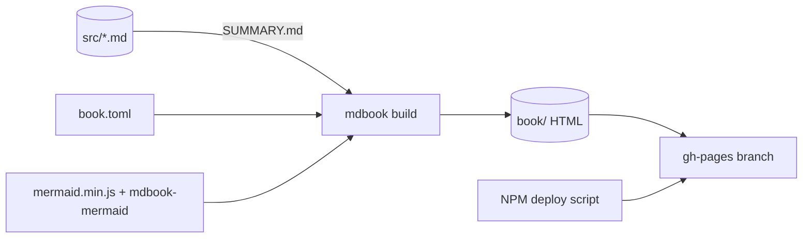
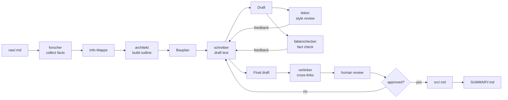

*Hinweis: Diese Inhalte wurden mit Unterstützung von Künstlicher Intelligenz erstellt und redaktionell überprüft (Transparenzhinweis gemäß Art. 50 EU AI Act).*

> Kopie der generierten OpenWiki-Seite `openwiki/architecture.md`. Das Original erzeugt der
> OpenWiki-Workflow; diese Kopie unter `src/` wird manuell nachgezogen und kann veraltet sein.

# Repository Architecture

The project is a static mdBook site. There is no application runtime; the repository contains Markdown content, configuration, agent tooling, operational documentation, and a small deploy wrapper.

## Directory layout

```
/                         Repository root
├── book.toml             mdBook configuration (incl. Mermaid preprocessor)
├── package.json          npm metadata + gh-pages deploy script
├── mermaid.min.js        Vendored Mermaid runtime (checked in)
├── mermaid-init.js       Theme-aware Mermaid initializer (checked in)
├── book/                 Generated static site (gitignored)
├── src/                  Markdown source content
│   ├── SUMMARY.md        Table of contents / navigation
│   ├── *.md              Content pages
│   └── openwiki/         Manual copies of generated OpenWiki pages
├── openwiki/             Generated code wiki (this documentation)
├── docs/                 Operational runbooks + verification screenshots
├── raw/                  Human draft area (gitignored, except README + template)
├── .claude/              Agent skills and subagent definitions
├── .agents/              Mirror of .claude/agents + .claude/skills for other agent runners (checked in)
├── AGENTS.md             Agent instructions referencing OpenWiki
└── CLAUDE.md             Claude Code guidance
```

## Build pipeline

1. **Content authoring** — pages are Markdown files in `src/`.
2. **Table of contents** — `src/SUMMARY.md` declares the page hierarchy. Only linked pages are rendered.
3. **mdBook build** — `mdbook build` reads `book.toml` and `src/` and writes static HTML into `book/`.
4. **Deploy** — `npm run ver` invokes `gh-pages -d book --nojekyll --cname wissen-ahrensburg.de`, pushing the `book/` directory to the `gh-pages` branch.



## mdBook configuration

`book.toml`:

```toml
[book]
title = "Ahrensburg – Wissensdatenbank"
description = "Eine Sammlung von Texten und Wissen über Ahrensburg, zusammengestellt aus dem Wiki-Export (Tenant: main)."
authors = ["Thorsten Klöhn"]
language = "de"
src = "src"

[output.html]
default-theme = "light"
preferred-dark-theme = "navy"
git-repository-url = ""
additional-js = ["mermaid.min.js", "mermaid-init.js"]

[preprocessor]

[preprocessor.mermaid]
command = "mdbook-mermaid"
```

Notes:

- `language = "de"` reflects that the book content is German.
- `git-repository-url` is intentionally empty; no repository link is rendered in the built site.
- `additional-js` loads the checked-in Mermaid runtime and theme initializer.
- The `mdbook-mermaid` preprocessor renders ` ```mermaid ` blocks as SVGs in the generated HTML.

## Mermaid diagram support

Mermaid diagrams are enabled via the `mdbook-mermaid` preprocessor. The required vendored assets live at the repo root and are checked in:

- `mermaid.min.js` — Mermaid runtime.
- `mermaid-init.js` — Picks the Mermaid theme (`default` for light themes, `dark` for dark themes) based on the active mdBook theme and reloads the page on theme switches.

`mdbook-mermaid` must be pinned to a version compatible with mdBook 0.4.x, for example `cargo install mdbook-mermaid --version 0.14.0`. Newer releases target mdBook 0.5 and fail with "Unable to parse the input".

## Content conventions

### AI transparency notice

Every content page must begin and end with the italic line:

```markdown
*Hinweis: Diese Inhalte wurden mit Unterstützung von Künstlicher Intelligenz erstellt und redaktionell überprüft (Transparenzhinweis gemäß Art. 50 EU AI Act).*
```

`src/datenschutz.md` is the documented exception and does not carry the notice.

### Internal links

Pages link to each other with relative `.md` paths:

```markdown
[Geschichte der Stadt Ahrensburg](geschichte-der-stadt-ahrensburg.md)
```

mdBook rewrites these to `.html` during the build.

### Page inclusion rule

A Markdown file under `src/` is only included in the generated book if it appears in `src/SUMMARY.md`. There are several files whose names duplicate others (for example `einkaufen-in-ahrensburg.md` and `einkaufen-in-ahrensburg-2.md`); only the version referenced in the summary is part of the rendered navigation.

### Manual OpenWiki copies

`src/openwiki/*.md` are hand-maintained copies of the generated `openwiki/*.md` pages. mdBook only builds files under `src/`, so the copies exist to include the OpenWiki documentation in the book's navigation. They must be kept in sync manually; the copy transformation replaces YAML frontmatter with the AI transparency notice and a copy notice blockquote, and appends the transparency notice at the end.

## Co-Wiki editorial pipeline

Content is produced through a human/AI collaboration described in `src/co-wiki.md` and operationalized via `.claude/`:

- **`.claude/skills/co-wiki/`** — skill guidance on roles, work models, workflow, and advanced patterns.
- **`.claude/agents/redaktion-*.md`** — subagent definitions for the multi-agent editorial pipeline (Forscher, Architekt, Schreiberling, Lektor, Faktenchecker, Verlinker, Aktualisierer).
- **`raw/`** — human draft area for article ideas before they become `src/` pages.



_Co-Wiki editorial pipeline: a raw draft is refined by specialized subagents and released to `src/` only after human approval._

The Supervisor is the main thread (or human); a subagent does not start other subagents.

## Deployment

Deployment is manual. There is no CI workflow in this repository. The operator runs:

```bash
npm install      # ensures gh-pages is available
mdbook build
npm run ver
```

The `gh-pages` package pushes `book/` to the `gh-pages` branch. The `--cname wissen-ahrensburg.de` option configures GitHub Pages to serve the custom domain, and `--nojekyll` disables Jekyll processing.

## Related pages

- [`overview.md`](overview.md) — high-level project overview.
- [`source-map.md`](source-map.md) — per-file repository map.
- [`docs/deploy-verification.md`](../docs/deploy-verification.md) — deploy runbook and CNAME-only diff check.

*Hinweis: Diese Inhalte wurden mit Unterstützung von Künstlicher Intelligenz erstellt und redaktionell überprüft (Transparenzhinweis gemäß Art. 50 EU AI Act).*
